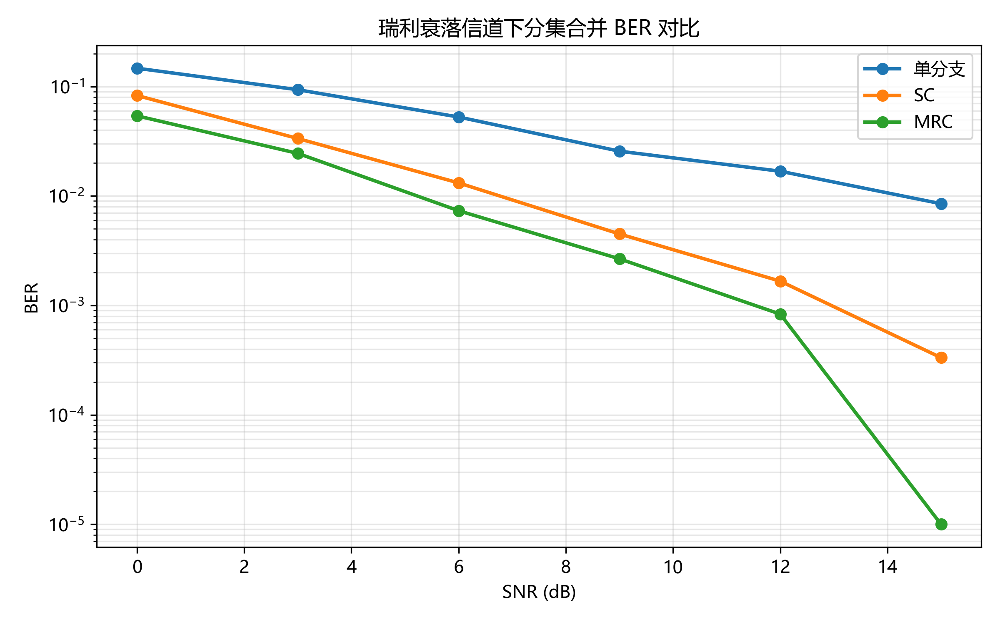
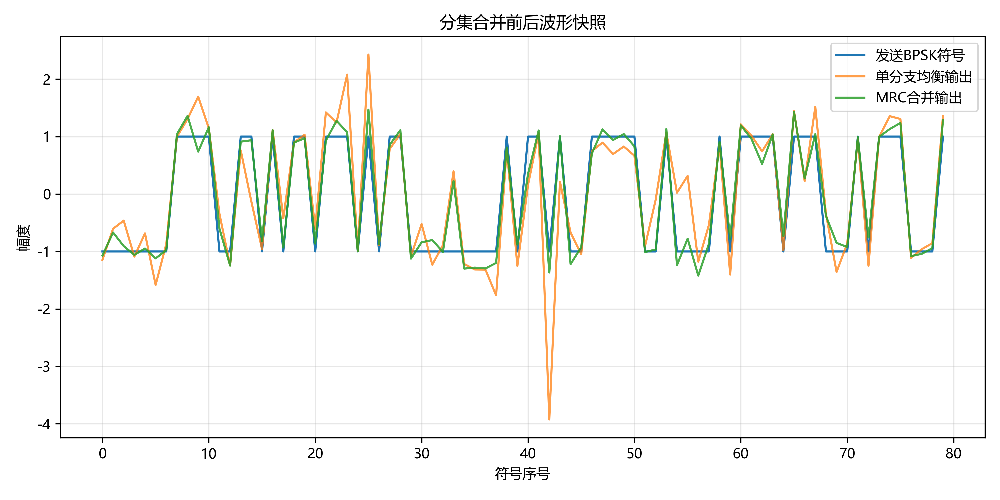
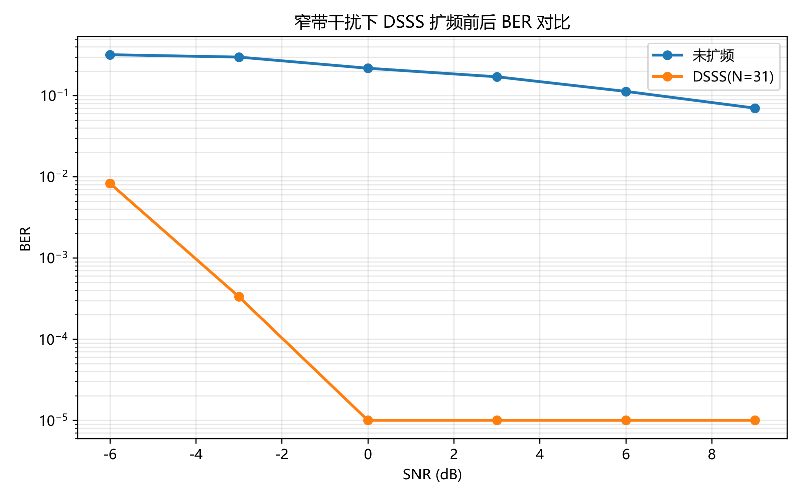
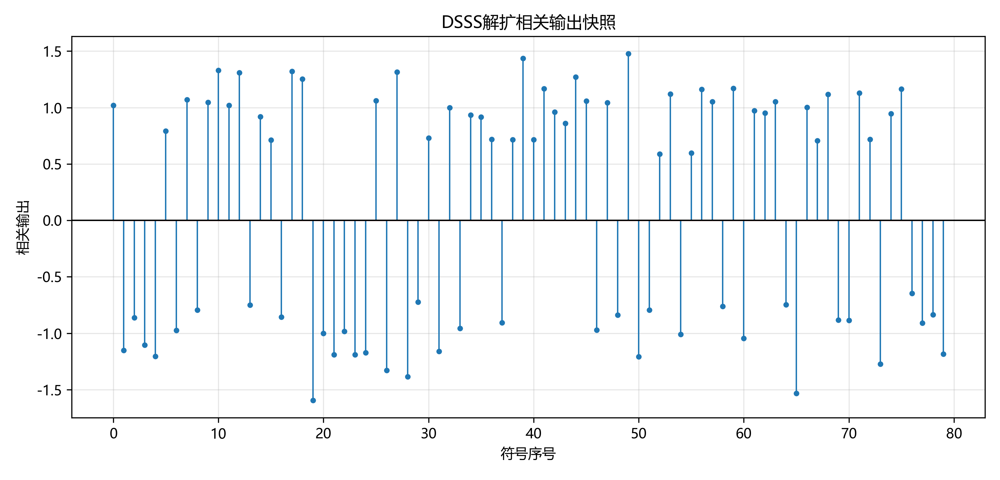

# 无线通信技术实验报告：分集与扩频通信

## 1. 实验目的

本实验的主要目的是理解无线通信系统中瑞利衰落对信号传输质量的影响，掌握分集接收技术和直接序列扩频通信的基本原理与实现方法。通过本实验，可以了解深衰落产生的原因，学习选择合并和最大比合并的基本思想，并通过 BER 曲线比较不同分集合并方法对系统性能的改善效果。

同时，本实验还要求实现直接序列扩频通信系统，包括 m 序列生成、扩频、加性高斯白噪声和窄带干扰建模、相关解扩以及处理增益计算。通过实验结果，可以观察 DSSS 系统在窄带干扰环境下对通信可靠性的改善作用。

此外，本实验还训练了使用 Python 完成通信系统仿真、使用 pytest 进行自动测试、通过 GitHub 提交实验代码并查看自动评分结果的能力。

## 2. 实验原理

### 2.1 分集合并

在无线通信中，信号在传播过程中会受到多径效应的影响。接收端收到的信号可能由多条不同传播路径叠加而成，这些路径具有不同的幅度、相位和时延。当多径信号发生相消叠加时，接收信号幅度会明显下降，这种现象称为深衰落。瑞利衰落模型常用于描述无明显直射路径条件下的无线信道。

对于第 i 个接收分支，接收信号可以表示为 r_i = h_i s + n_i。其中，r_i表示第 i 个分支接收到的信号，h_i 表示第 i 个分支的复信道系数，s 表示发送符号，n_i 表示噪声。

分集接收的基本思想是：利用多个相互独立或相关性较低的接收分支，使所有分支同时处于深衰落的概率显著降低，从而提高系统可靠性。

这种由多个分支带来的抗衰落性能提升称为分集增益。具体来说，在相同的信噪比条件下，采用分集接收后系统的误码率通常会低于单分支接收；或者在达到相同误码率要求时，分集系统所需的信噪比更低。分集增益的本质原因是多个独立分支同时发生深衰落的概率远小于单个分支发生深衰落的概率。若有 $L$ 个相互独立的接收分支，则系统可以获得更高的分集阶数，BER 曲线在高 SNR 区域下降得更快。SC 和 MRC 都可以获得分集增益，但 MRC 由于利用了所有分支的信息，通常比 SC 具有更好的性能。本实验主要实现了选择合并 SC 和最大比合并 MRC。

选择合并 SC 的思想是：对于每个符号，从多个接收分支中选择信道增益最大的那个分支进行均衡。其选择准则为：k = \arg\max_i |h_i|^2。选择第 k 个分支后，符号估计为：\hat{s} = \frac{r_k}{h_k}

最大比合并 MRC 的思想是：不只选择一个分支，而是将所有分支按照信道质量进行加权合并。由于信道是复数，会同时改变信号的幅度和相位，因此合并时需要乘以信道共轭来校正相位。MRC 的符号估计公式为：\hat{s} = \frac{\sum_i h_i^* r_i}{\sum_i |h_i|^2}。其中，h_i^* 表示信道系数的共轭。与 SC 相比，MRC 充分利用了所有接收分支的信息，因此通常具有更好的抗衰落性能和更低的误码率。

说明瑞利衰落、深衰落、选择合并 SC、最大比合并 MRC 和分集增益。

### 2.2 扩频通信

直接序列扩频通信 DSSS的基本思想是：在发送端用高速伪随机码序列对低速信息符号进行扩展，使原本较窄带的信息信号扩展到更宽的频带中。接收端使用相同的伪随机码序列进行相关解扩，从而恢复原始信息。

本实验中，首先使用线性反馈移位寄存器生成 m 序列。m 序列是一种常见的伪随机序列，具有较好的自相关特性。LFSR 通过寄存器移位和抽头反馈产生周期性伪随机序列。需要注意的是，寄存器初始状态不能全为 0，因为全 0 状态经过反馈后仍会保持全 0，无法产生有效的伪随机序列。

在 DSSS 扩频过程中，信息比特首先进行 BPSK 映射：0 \rightarrow +1,\quad 1 \rightarrow -1

然后每个 BPSK 符号与完整的 PN 码片序列相乘，从而得到扩频后的码片序列。若扩频因子为 N，则每 1 个信息符号会被扩展为 N 个码片。因此，扩频后的信号速率高于原始信息符号速率，信号带宽也相应变宽。

接收端解扩时，将接收码片按照扩频因子分组，并与本地相同的 PN 序列做相关运算：C = \sum_{n=1}^{N} r[n]c[n]

其中，r[n] 为接收码片，c[n] 为本地 PN 码片。如果相关结果为非负，则说明接收序列更接近正向 PN 序列，判决为比特 0；如果相关结果为负，则说明接收序列更接近反向 PN 序列，判决为比特 1。

DSSS 的处理增益由扩频因子决定，计算公式为：G_p = 10\log_{10}(N)。

其中，$N$ 为扩频因子。扩频因子越大，处理增益越高，系统对噪声和窄带干扰的抑制能力通常越强。本实验中使用长度为 31 的 PN 序列时，处理增益约为：10\log_{10}(31) \approx 14.91\text{ dB}

DSSS 能够抑制窄带干扰的原因是：目标信号在发送端被 PN 序列扩展，在接收端通过相同 PN 序列相关解扩后重新集中；而窄带干扰由于与 PN 序列不同步，也不具备相同的扩频结构，经过解扩相关后会被扩展和摊薄。因此，窄带干扰对最终比特判决的影响会减小，系统误码率也会得到改善。

## 3. 实验环境

- Python 版本：Python 3.13
- 主要依赖：NumPy、Matplotlib、pytest
- AI 助手使用情况：本实验过程中使用了 GPT-5.5 Thinking 大语言模型作为辅助工具。

## 4. 实验方法与步骤

### 4.1 Part 1：分集合并

Part 1 主要完成分集合并系统的仿真。实验中首先随机生成二进制比特序列，并将其进行 BPSK 调制，其中比特 0 映射为 +1，比特 1 映射为 -1。之后，调制符号通过瑞利衰落多分支信道，并叠加加性高斯白噪声。

在接收端，首先实现无分集的单分支均衡方法，即只使用第一个接收分支，通过 r/h 对信道影响进行补偿。然后分别实现选择合并 SC 和最大比合并 MRC。SC 对每个符号选择 |h|^2 最大的接收分支进行均衡；MRC 则使用所有分支的信息，通过共轭相乘和信道功率归一化完成加权合并。

在不同 SNR 条件下，分别统计单分支、SC 和 MRC 三种方法的误码率，并绘制 BER 曲线。同时，实验还生成了分集合并前后部分符号波形的对比图，用于直观观察 MRC 对接收信号的改善效果。

### 4.2 Part 2：DSSS 扩频通信

Part 2 主要完成直接序列扩频通信系统的仿真。首先使用 LFSR 生成 m 序列，并将输出比特映射为双极性 PN 码片，其中 0 映射为 +1，1 映射为 -1。

发送端先生成随机信息比特，并进行 BPSK 调制。随后，每个 BPSK 符号乘以完整的 PN 序列，得到扩频码片序列。为了比较扩频前后的抗干扰性能，实验分别对未扩频 BPSK 信号和 DSSS 扩频信号加入窄带干扰和加性高斯白噪声。

接收端对于 DSSS 信号进行相关解扩。具体做法是将接收码片按照 PN 序列长度进行分组，每一组与本地 PN 序列做相关运算，并根据相关结果的正负进行硬判决。之后统计误码率，并与未扩频系统的 BER 曲线进行对比。

此外，实验还实现了处理增益计算函数：G_p = 10\log_{10}(N)

当 PN 序列长度为 31 时，处理增益约为：10\log_{10}(31) \approx 14.91\text{ dB}

## 5. 实验结果

插入结果图：

## 6. 结果分析与讨论

回答：

1. 为什么瑞利衰落会造成深衰落？
瑞利衰落通常出现在没有明显直射路径的无线传播环境中。接收端收到的信号是多条反射、绕射和散射路径信号的叠加。由于不同路径的传播距离不同，信号到达接收端时会具有不同的相位。当多条路径信号的相位接近相反时，它们会发生相消叠加，使合成信号幅度明显下降，这种现象就是深衰落。深衰落会使接收信号功率降低，导致信噪比下降，从而增加误码率。

2. SC 和 MRC 的合并思想有什么不同？
SC 的合并思想是“选择最好的一个分支”。对于每个符号，SC 会比较所有接收分支的信道功率 |h|^2，只选择当前信道增益最大的分支进行均衡。SC 的优点是实现简单、计算量较小，但它没有利用其他分支中仍然存在的有用信息。
MRC 的合并思想是“把所有分支按信道质量加权合并”。MRC 会先利用信道共轭对各分支信号进行相位校正，然后根据信道增益大小进行加权，并用总信道功率进行归一化。与 SC 不同，MRC 不会丢弃较弱分支的信息，而是综合利用所有分支，因此能够获得更好的合并效果。

3. 为什么 MRC 通常优于 SC？
MRC 通常优于 SC，是因为 MRC 充分利用了所有接收分支的信息，而 SC 只使用其中一个最强分支。即使某些分支的信道增益较小，它们仍然可能包含有用的信号成分。MRC 通过加权方式让强分支贡献更多、弱分支贡献较少，从而提高合并后的等效信噪比。因此，在相同 SNR 和相同分支数条件下，MRC 的 BER 通常低于 SC 和单分支接收。

4. DSSS 的处理增益如何由扩频因子决定？
DSSS 的处理增益由扩频因子 N 决定，其计算公式为：G_p = 10\log_{10}(N)。N 表示每个信息符号被扩展成的码片数量。扩频因子越大，说明每个信息符号被扩展得越长，接收端通过相关解扩时能够获得越高的处理增益。本实验中 PN 序列长度为 31，因此处理增益约为：14.91dB。这说明扩频系统在解扩后可以获得一定的抗噪声和抗干扰能力。

5. 窄带干扰经过解扩后为什么会被摊薄？
DSSS 系统中，目标信号在发送端与 PN 序列相乘实现扩频，接收端再使用相同的 PN 序列进行相关解扩。由于目标信号与本地 PN 序列同步，所以经过解扩后能够重新集中回原始信息符号上。
窄带干扰与 PN 序列没有同步关系，也不具有相同的扩频结构。当接收端用 PN 序列进行解扩时，目标信号能够被正确相关累加，而窄带干扰会被 PN 序列调制到较宽的频带中，相当于被扩展和摊薄。因此，窄带干扰在最终判决中的影响会减小，系统的 BER 也会得到改善。

6. 本实验中 BER 曲线是否符合理论预期？
本实验中的 BER 曲线基本符合理论预期。在 Part 1 中，随着 SNR 增大，单分支、SC 和 MRC 的 BER 都逐渐降低。同时，SC 的性能优于单分支，MRC 的性能通常优于 SC。这说明分集接收能够降低瑞利衰落带来的误码率，而 MRC 由于充分利用了多个接收分支的信息，因此具有更好的分集增益。
在 Part 2 中，DSSS 系统在窄带干扰环境下的 BER 通常低于未扩频系统，说明扩频和相关解扩能够抑制窄带干扰。由于仿真中存在随机比特、随机噪声和干扰，因此个别 SNR 点可能出现轻微波动，但整体趋势与理论分析一致。

## 7. 实验心得
通过本次实验，我对无线通信中的分集接收和直接序列扩频通信有了更加直观的理解。在分集合并部分，我认识到瑞利衰落会导致接收信号出现深衰落，而多个接收分支可以降低所有分支同时处于深衰落的概率。通过 BER 曲线可以明显看出，SC 和 MRC 都能够改善系统性能，其中 MRC 的效果更好，因为它综合利用了所有接收分支的信息。
在 DSSS 扩频通信部分，我理解了扩频并不是简单地增加信号长度，而是通过 PN 码将每个信息符号扩展为多个码片，使信号频谱变宽。接收端使用相同 PN 序列进行相关解扩后，目标信号能够重新集中，而窄带干扰会被摊薄，因此系统具有更好的抗干扰能力。
此外，本实验也让我熟悉了使用 Python 进行通信系统仿真、使用 pytest 进行自动测试以及通过 GitHub 提交实验代码的流程。自动评分可以帮助我及时发现代码中的问题，AI 工具则可以帮助我更好地理解和学习实验原理，检查代码中的bug与可优化的部分。

## 8. 参考资料

- 课程课件：第8章 分集
- 课程课件：第9章 扩展频谱通信
